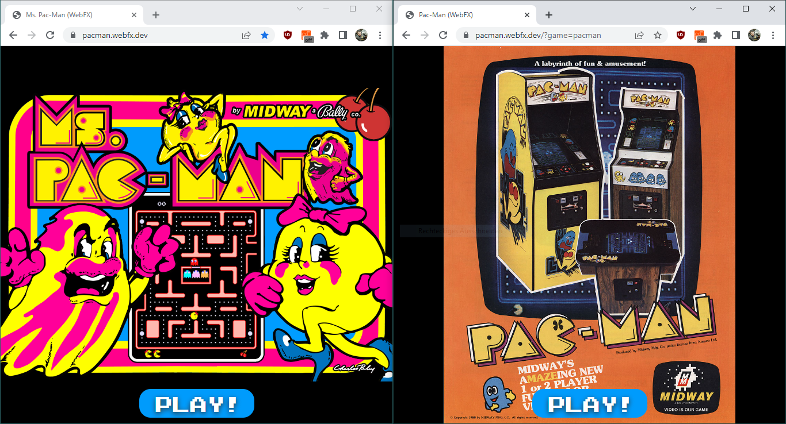
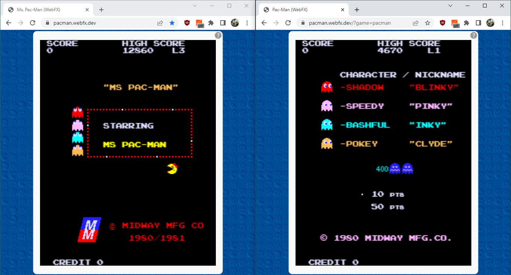
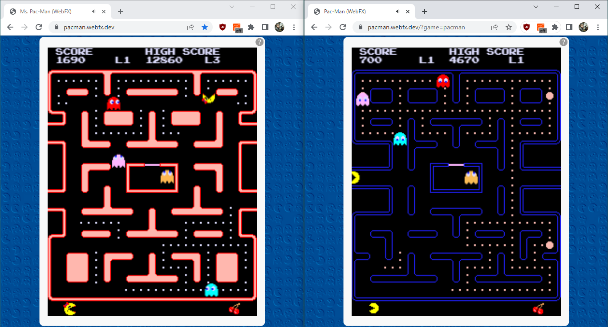

# A JavaFX UI (2D) for Pac-Man and Ms. Pac-Man

## About this project

This is a WebFX port of the user interface for the UI-agnostic [Pac-Man / Ms. Pac-Man game](https://github.com/armin-reichert/pacman-basic) implementation. (This version contains no 3D scenes). It can be run on all platforms supported by WebFX, especially inside a browser via the GWT implementation.

## How to use

The game can be started by opening the following URL(s) in a browser:
- [Ms. Pac-Man game](https://pacman.webfx.dev/)
- [Pac-Man game](https://pacman.webfx.dev/?game=pacman)

### With a keyboard

From the intro scene of either game, you can switch to the other game by pressing <kbd>V</kbd>. To start the game, you first have to "insert a coin" by pressing <kbd>5</kbd>. After you have credit, the game can be started by pressing <kbd>1</kbd> (I used these keys because they are also used by the MAME Arcade emulator).

Pac-Man steering:
- Pac-Man is steered using the cursor keys.

Simulation control:
  - <kbd>P</kbd>: Toggle pause mode
  - <kbd>Shift+P</kbd> or <kbd>Space</kbd>: Single step
  - <kbd>T</kbd>: Ten steps
  - <kbd>Alt+Shift+F</kbd>: Run faster (in 5 Hz steps)
  - <kbd>Alt+Shift+S</kbd>: Run slower (in 5 Hz steps)
  - <kbd>Alt+Shift+0</kbd>: Run at 60 Hz

Test modes: (available from intro screens)
  - <kbd>Alt+Shift+T</kbd>: Start level test mode (plays each level for some seconds)
  - <kbd>Alt+Shift+C</kbd>: Play the cutscenes of the game

Cheats:
  - <kbd>Alt+Shift+A</kbd>: Toggle autopilot mode
  - <kbd>Alt+Shift+I</kbd>: Toggle immunity mode

Play scene cheats:
  - <kbd>Alt+Shift+E</kbd>: Eat all pills except the energizers
  - <kbd>Alt+Shift+L</kbd>: Add 3 player lives
  - <kbd>Alt+Shift+N</kbd>: Enter next game level
  - <kbd>Alt+Shift+X</kbd>: Kill all ghosts outside of the ghosthouse 

### With mouse or touch screen

- Intro scene: Click/tap anywhere to "add a coin" and change to the "credit scene".
- Credit scene: Click/tap anywhere to start the game and change to the play scene. 
- Play scene: To steer Pac-Man, use a mouse drag or a "wipe" gesture. Dragging / wiping on the lower part of the maze to any direction causes Pac-Man to move to that direction (as soon as he can).

## How it looks

